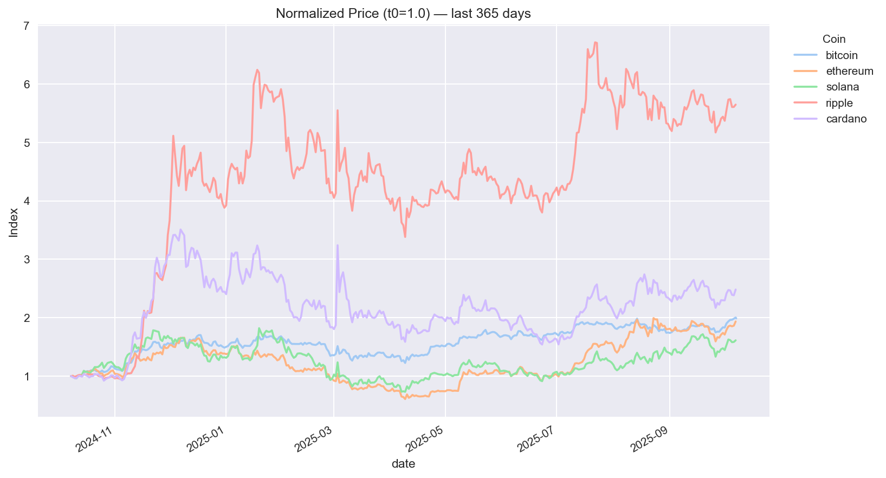
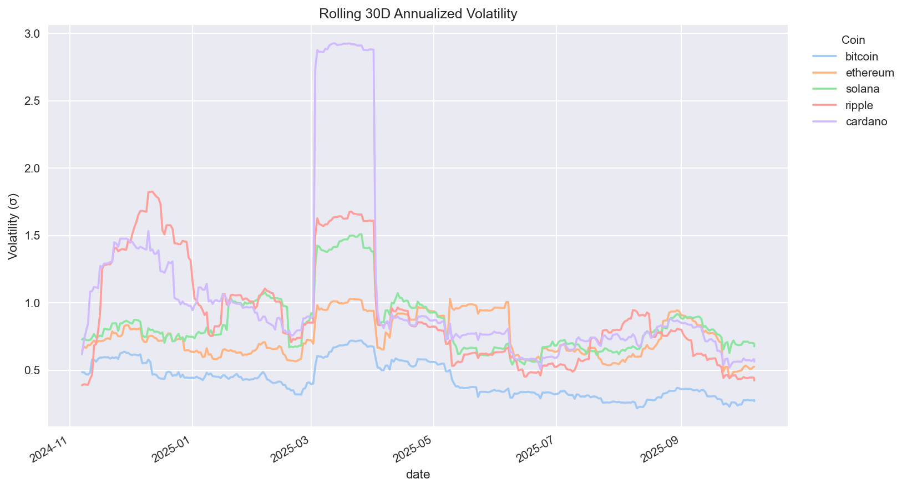
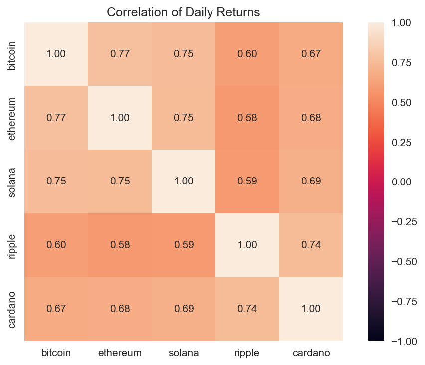
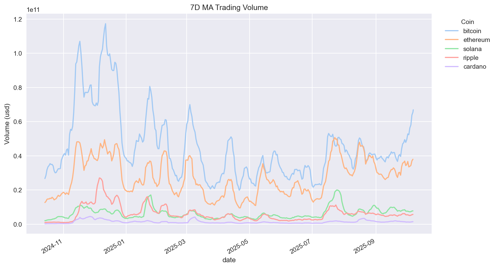
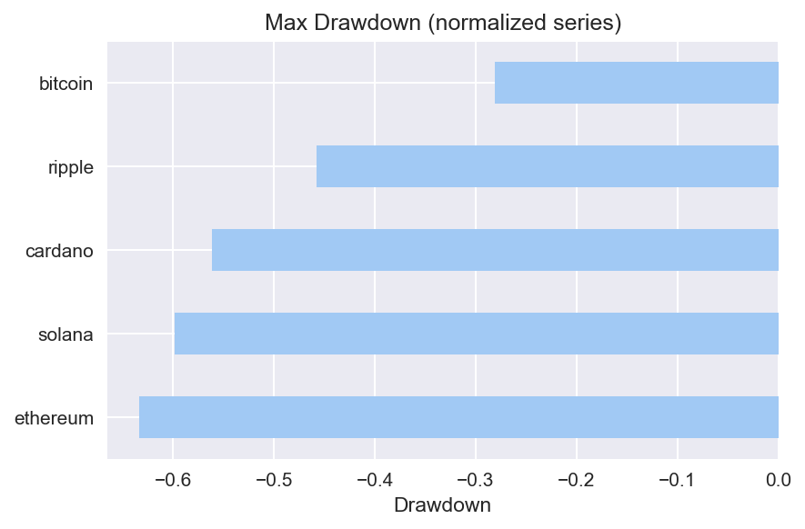

# 💹 Crypto Market Analysis (Python + CoinGecko API)

## Overview

Python-based analysis of major cryptocurrencies (BTC, ETH, SOL, XRP, ADA) using the public **CoinGecko API**.  
We fetch prices/market caps/volumes, compute returns & volatility, and visualize trends + correlations.

---

## Stack

- Python, pandas, numpy
- requests (API client)
- matplotlib, seaborn
- Jupyter Notebook

---

## What’s inside

- `/notebooks/crypto_analysis.ipynb` — full workflow
- `/data/` — cached API responses & exported CSVs (prices, volumes, caps)
- `/images/` — saved charts for quick viewing

---

## Key charts







---

## How to run

```bash
git clone https://github.com/Blladerunner/crypto-market-analysis.git
cd crypto-market-analysis

python -m venv .venv
.\.venv\Scripts\Activate.ps1   # Windows
# source .venv/bin/activate    # macOS/Linux

pip install -r requirements.txt
python -m notebook notebooks/crypto_analysis.ipynb
```
